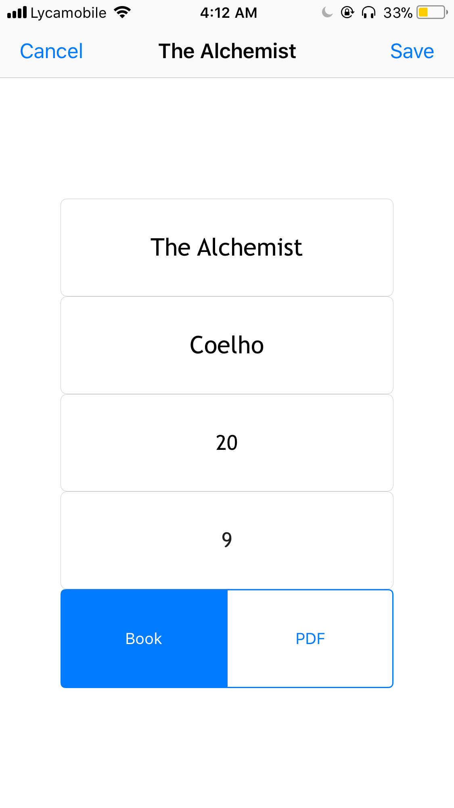
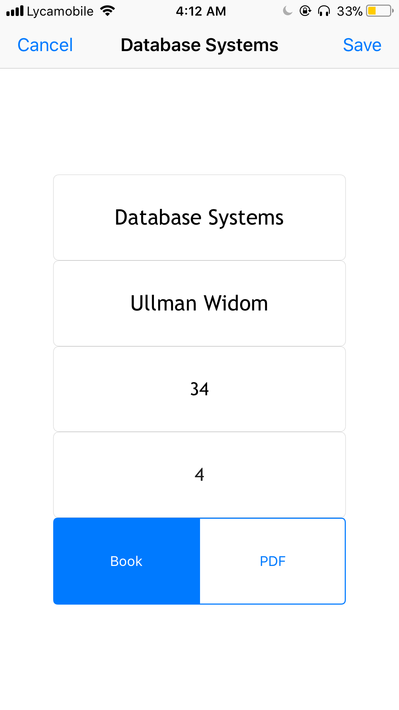
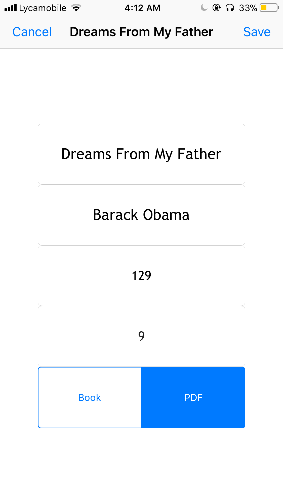

# BookGuru
Created by Assumani, Medi on 2/26/18.
Copyright © 2018 Assumani, Medi. All rights reserved.
##### Developer : Medi W. Assumani
##### Technologies : Swift 4 and Xcode 9
##### Version : 1.0.0
##   Description
Students, as well as literacy enthusiast tend to read many books simutaneously, but it can be hard to keep track of your books, the last page read, etc... Instead of using the old school/old fashioned book markers, BookGuru introduces a simple feature where user can keep track of the book name, the author name, the last page read, last line read, and wheater the book is physical or a pdf. So when you pick up that book you haven't read in three months, you will know excatly where you stopped.
##   Features
* Adding new book reference
* Book references are saved on your device, can be accessed anytime
* Editing the book reference when needed
* Deleting the book reference
##   Implementations
* UITableViewController to have a scrollable menu of book references
* CoreData Framework to persist each of the user's book reference
* UseDefaults to persist the UISegmenControl after pressing "save"
##   Bugs To Fix
* <strike>App crashes when editing book data</strike>
* <strike>App crashes when "save" button pressed after leaving the text fields empty</strike>
* <b>App crashes when anything besides integer is typed in the "last page read" and "last line read" text fields</b>
* Keyboard overlaps with text fileds
##   Screeshots

